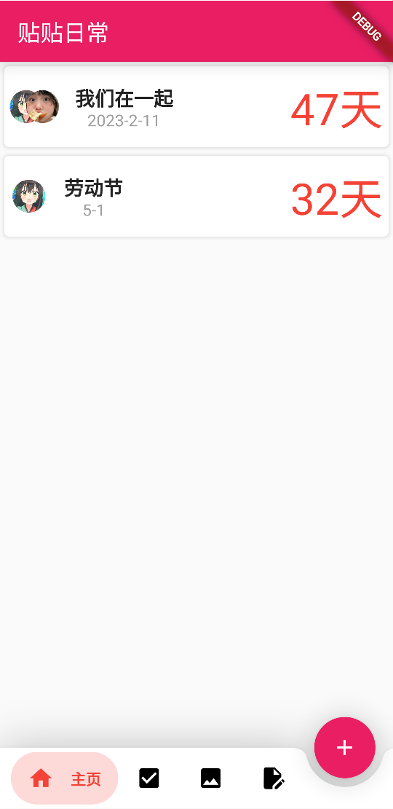
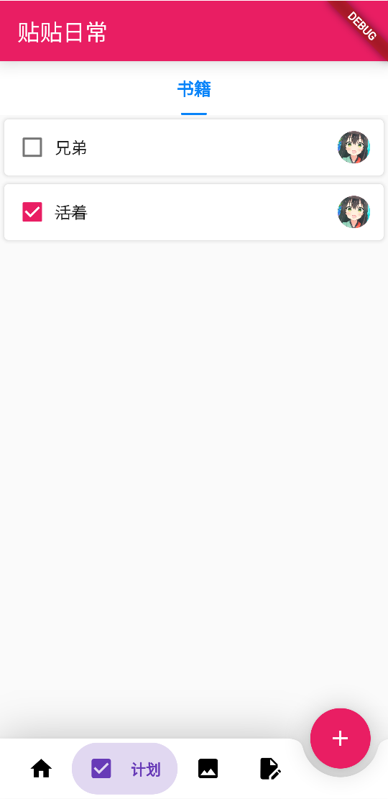
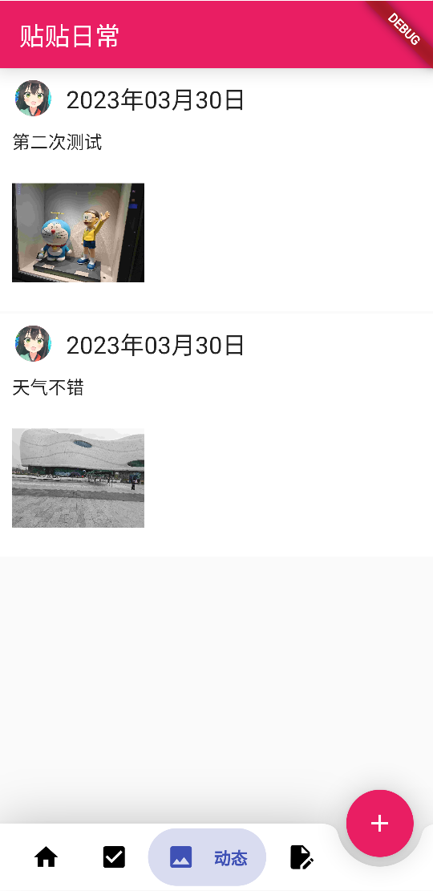
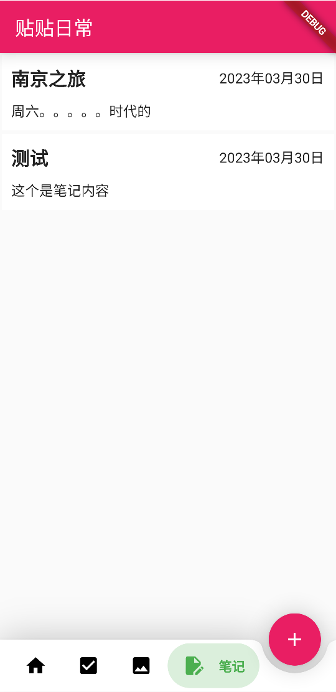

## 贴贴日常

一个记录恋爱日常的APP

### 项目结构

- love 前端部分，使用flutter开发
- love_back 后端部分，使用rust开发

### 效果演示

|     |     |
|-----|-----|
|     |     |

### 使用说明

为了避免接口被随意请求，每次请求都需要带上密钥

- 后端的密钥和mongo地址在`love_back/app.yaml`中
- 前端的请求地址和密钥在`love/lib/utils/http.dart`中

```bash
# 后端运行（因为涉及到图片压缩库，目前只支持Linux）
cargo run
# 后端编译
cargo build --release
# 前端运行
flutter run -d edge --no-sound-null-safety
# 安卓编译
flutter build apk --verbose --no-sound-null-safety
```